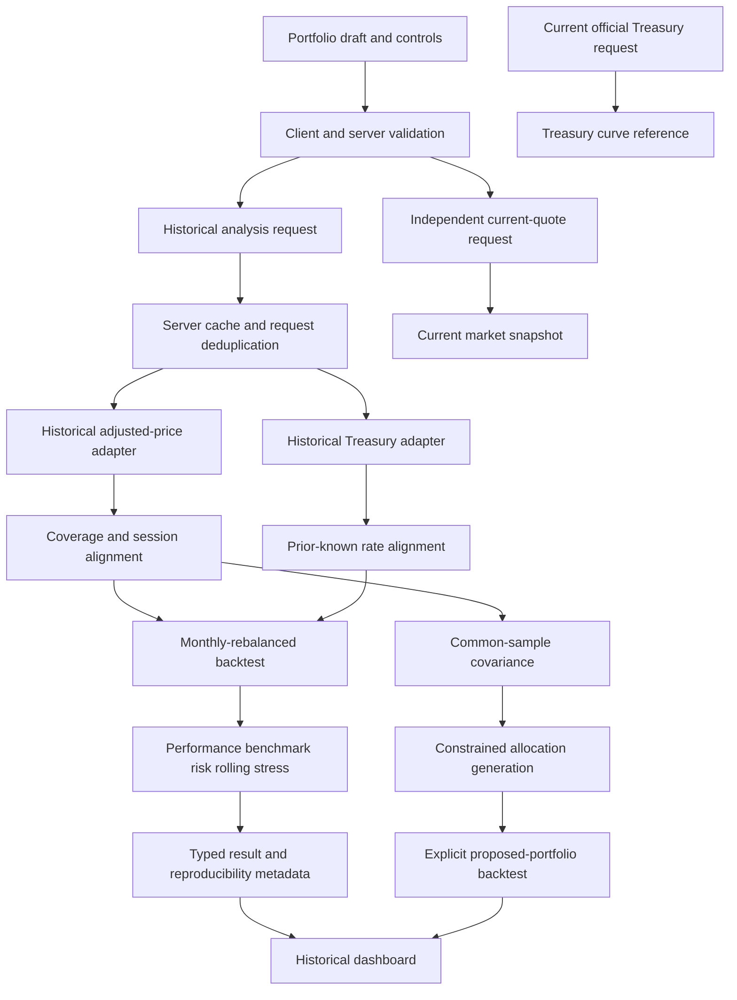

# Portfolio Intelligence & Construction Lab Implementation Plan

> **For agentic workers:** When implementation is authorized, use `superpowers:executing-plans` to implement the approved plan task by task. Checkboxes below track future work, not work completed during planning.

**Goal:** Establish the architecture, financial methodology, data strategy, and phased delivery plan requested by the spec's FIRST TASK; do not build the application yet.

**Architecture:** A Next.js application with server-only data adapters and orchestration, a deterministic TypeScript analytics engine, and presentation components consuming typed results. Historical analysis and current market context have separate data paths and failure states.

**Tech stack:** Proposed Next.js, TypeScript, Tailwind CSS, Recharts, Zod, and Vitest; browser workflow tests with Playwright. No existing stack or versions are present to preserve. Select compatible maintained versions and a lockfile during approved setup.

**Spec:** [Portfolio Intelligence & Construction Lab — Revised Build Instructions](PORTFOLIO-LAB-SPEC.md), read in full, including §77 FIRST TASK.

**Canonical source:** The user renamed the original revised-instructions file to `docs/PORTFOLIO-LAB-SPEC.md` without changing its contents. All references in this plan use that canonical path.

**Status:** Methodology reviewed on 2026-09-28; planning only. Implementation requires plan approval. Primary-source methodology documentation was checked during this review and is linked where relevant. Actual API access, licensing, quotas, data completeness, and deployment compatibility remain unqualified.

## Methodology review outcome

The core return, sample covariance, Euler risk-contribution, Sharpe/Sortino, and benchmark formulas are consistent with the spec. The review corrected or made explicit the following material implementation risks; these requirements are incorporated below and into the acceptance tests.

| Finding | Required correction |
| --- | --- |
| Rate date was insufficient to establish availability; DGS3MO is a quoted yield, not an effective annual cash return | Use a publication-aware cutoff, retain the spec's conversion only as an explicit modeling convention, and prohibit discount-yield substitution |
| Month-end execution and distribution treatment were underspecified | Define synthetic close-to-close total-return accounting, fixed targets known in advance, frictionless closing resets, and no double-counted distributions |
| Missing observations could produce incompatible samples or compressed rolling windows | Preserve interval identities, expose sample identity per metric, and require consecutive sessions for rolling windows |
| Zero-risk CASH could be confused with empirical volatility of accrued cash | Identify the target-risk approximation separately, retain actual accrual in realized metrics, and handle all-cash identities correctly |
| Fixed CASH was not reflected in optimizer feasibility bounds | Enforce the residual risky budget, define constrained objectives, and distinguish solver convergence from achieved equal risk |
| Optimized historical comparisons could imply executable past performance | Mark every reused-estimation/event comparison as retrospective, including disjoint earlier periods; require separate lagged walk-forward methodology for strategy claims |
| Stale endpoints and adjustment-cache boundaries could hide losses or create artificial returns | Distinguish missing data from inception/delisting, prevent silent terminal truncation, and use coherent adjustment snapshots |
| ETF benchmarks and raw day-price changes could be mislabeled | Identify fund returns versus index returns and keep current price-change estimates separate from historical total-return-aware returns |

These are implementation clarifications of the spec, not edits to the spec. CASH risk approximation, synthetic yield conversion, and in-sample construction limitations must be visible to users, not confined to engineering documentation.

## Repository inspection

Inspection on 2026-09-28 found:

| Area | Observed state | Planning consequence |
| --- | --- | --- |
| Repository | Initialized Git repository on `main`, with no commits and no configured remote | Treat this as a new application; no integration conventions can be inferred |
| Files | Specification under `docs/` and a root `.DS_Store` | Preserve existing files; this task adds only this plan |
| Architecture and components | No application source, reusable components, routes, or styles | Proposed structure below is new, not an existing convention |
| Dependencies | No package manifest, lockfile, or build/test configuration | No installed project dependencies or supported runtime can be assumed |
| Portfolio design | No portfolio website URL, assets, screenshots, tokens, or other projects supplied | Obtain the existing portfolio reference and extract its design system before UI implementation |
| Deployment | No deployment configuration, environment template, CI workflow, or hosting evidence | Confirm deployment target before locking runtime and cache infrastructure |
| Repository guidance | No repository `AGENTS.md` found in the file inventory | No additional repository-specific instructions identified |

The existing portfolio design and hosting environment could not be inspected because they are not represented in this checkout. This is an explicit dependency, not evidence that the user has no existing portfolio or deployment.

## Global constraints

These requirements apply to every phase; quoted lines preserve the spec's wording.

- “Do not place finance formulas directly in React components.”
- “The analytics engine must be reusable outside the UI.”
- “Avoid `any`.”
- “V1 should not require a paid market-data subscription.”
- “Never describe delayed or end-of-day data as real-time.”
- “Do not make historical analytics depend on the availability of current quotes.”
- “All portfolio and benchmark return series must use the same return convention.”
- “Do not blindly forward-fill asset prices.”
- “Do not use today's Treasury yield for historical performance metrics.”
- “Use 252 trading days for risk annualization.”
- “Never clamp negative risk contributions to zero.”
- “Do not display Infinity or NaN.”
- “Do not generate personalized investment recommendations.”
- “Use localStorage.” No login or account requirement.
- V1 has monthly rebalancing, long-only portfolio inputs, approximately 20 holdings maximum, and no required AI layer.

## Review focus

Five particularly consequential cases are assigned to phase acceptance checks below:

1. An interior missing asset price must not become a zero return or a multi-session return treated as daily (Phase 1).
2. A Treasury observation date must not be mistaken for its publication/availability time, introducing look-ahead (Phase 1).
3. A stale quote or provider change must not alter historical metrics or acquire an unsupported live label (Phase 1).
4. All-cash, zero-volatility, and constant-benchmark inputs must produce reasoned unavailable metrics, not non-finite numbers (Phases 2–4).
5. Invalid covariance, infeasible bounds, and failed optimization must never produce a purportedly successful allocation; singular but valid PSD covariance needs separate nonuniqueness/solver handling (Phase 6).

## 1. Proposed application architecture

Use a single deployable application initially. Keep provider credentials, external fetches, rate protection, and caching on the server. Use pure functions for alignment, backtesting, and analytics, with time and data passed explicitly rather than read implicitly inside calculations.

Proposed file responsibilities:

| Path | Responsibility |
| --- | --- |
| `app/layout.tsx`, `app/page.tsx`, `app/globals.css` | Application shell, composed page, extracted design tokens |
| `app/api/analysis/route.ts` | Validate configuration and return historical analysis with typed quality states |
| `app/api/quotes/route.ts` | Separate optional current-quote request |
| `app/api/treasury/current/route.ts` | Latest official Treasury context |
| `components/` | Presentation hierarchy in section 14 |
| `lib/types/{portfolio,data,analytics,construction}.ts` | Shared domain contracts and discriminated results |
| `lib/validation/{portfolio,dates,symbols}.ts` | Client/server validation schemas |
| `lib/market-data/{types,historical,quotes,normalize,fallback}.ts` | Provider-independent contracts, normalization, fallback policy |
| `lib/market-data/providers/yahoo.ts` | Candidate unofficial provider, enabled only after qualification |
| `lib/treasury-data/{types,historical,current,alignment}.ts` | Historical proxy, current curve, and prior-known rate lookup |
| `lib/backtest/{coverage,calendar,alignment,engine,metadata}.ts` | Coverage, session validation, portfolio simulation, provenance |
| `lib/analytics/` | Financial modules in section 9 |
| `lib/server/{analyze,cache,rateLimit}.ts` | Server orchestration and infrastructure boundaries |
| `lib/state/{portfolioReducer,persistence}.ts` | Draft state and versioned browser persistence |
| `lib/utils/{dates,numerical,format}.ts` | Date arithmetic, numerical guards, display formatting |
| `config/{methodology,providers,stressWindows,samplePortfolio}.ts` | Versioned policy and reproducible presets |
| `tests/{analytics,backtest,data,validation,components,e2e}/` | Deterministic tests and user workflows |
| `tests/fixtures/` | Small, attributable provider fixtures and hand-calculated numerical cases |
| `docs/{DESIGN-SYSTEM,DATA-PROVIDERS,METHODOLOGY,DEPLOYMENT}.md` | Future design evidence, provider qualification, formulas, operating instructions |

Keep route handlers thin. `lib/server/analyze.ts` coordinates validated inputs, adapter results, coverage, simulation, and analytics. Provider modules must never be imported into client bundles. No database, authentication, Web Worker, or global state library is necessary initially.

Contracts must distinguish decimal weights/returns/yields from display percentages, market dates from UTC timestamps, and data failure from undefined mathematical results. A metric result carries either a finite value and sample metadata or an unavailable reason; it never serializes `NaN` or `Infinity`.

Define the spec's `PortfolioHolding`, `PortfolioConfig`, `PriceObservation`, `ReturnObservation`, `TreasuryObservation`, `DataCoverage`, `PortfolioMetrics`, `RiskMetrics`, `BenchmarkMetrics`, `RiskContribution`, `DrawdownEpisode`, `StressTestResult`, `BacktestResult`, `ConstructionResult`, `OptimizationConstraint`, `MethodologyMetadata`, and `DataQualityState`. Extend observations with interval boundaries and provenance through wrapper types rather than losing the spec's simple normalized shapes.

## 2. Product naming recommendation

Use **Portfolio Risk & Analytics Lab** for the analytics-first milestone. Switch to **Portfolio Intelligence & Construction Lab** when the constructor is available. This follows §2 and resolves the later hero's use of the construction name before that capability exists.

Use “Risk Contribution at Target Weights” and a separate “Daily / Period Arithmetic Return Contribution” label. Do not call the product Performance Attribution or imply Brinson attribution. Section 75's full acceptance target includes construction even though the naming section calls that a V2 milestone; construction remains in Phase 6, not silently omitted from delivery.

## 3. Historical data-source strategy

Qualify providers in the spec's order: official source, documented public API, reputable free tier, isolated unofficial endpoint. A Yahoo Finance adapter is the initial candidate permitted by the spec, not a confirmed production dependency.

- Fetch adjusted, distribution-aware historical prices server-side for holdings and benchmark under the same return convention. Verify adjustment semantics against known splits and distributions before enabling a provider.
- Preserve security identity, currency, provider, convention, requested interval, actual coverage, fetch time, and snapshot hash. Proposed initial universe: USD-denominated U.S.-listed equities and ETFs plus synthetic CASH; mixed currency and nonmatching calendars require later explicit methodologies.
- Reject invalid/nonpositive/non-finite prices. Sort observations, collapse identical duplicate dates, and reject conflicting duplicates instead of silently choosing a price.
- Fetch sufficient context for session checks and prior-known rates. Do not include a pre-start holding return in the user's requested performance interval.
- Never substitute raw close for adjusted close, another ticker for a missing security, or CASH for a failed holding. Whole historical series may switch provider only after equivalent semantics are confirmed; do not splice adjustment scales.
- Qualify all sample symbols and SPY, VT, QQQ, AGG benchmark choices. Record provider terms, retention/display permissions, authentication requirements, quotas, and cloud-host access results in `docs/DATA-PROVIDERS.md`.

Adjusted-close ratios are a provider-defined total-return-aware proxy, not a guarantee of an exact gross total-return index or executable fills. Yahoo documents split and distribution adjustment; validate the selected endpoint independently, including capital-gain distributions and special corporate actions. Do not add dividends again to an adjusted-return stream. Document reinvestment and withholding conventions; fund expenses embedded in fund prices remain embedded. [Yahoo adjusted-close documentation](https://help.yahoo.com/kb/SLN28256.html).

Distinguish first available provider observation from verified security inception. An endpoint's history limit is a provider coverage limit, not an IPO date. Security identity must include exchange/currency and known symbol changes. Do not splice reused ticker symbols. An unexplained terminal zero, delisting, merger, liquidation, or halted series is a coverage/corporate-action failure, not permission to drop the holding or stop just before its loss. V1 must block a complete result across unsupported terminal events; a historical prefix may be shown only as explicitly incomplete. A verified total loss needs dedicated terminal-event accounting rather than ordinary positive-price normalization.

## 4. Current / live quote strategy

Provide a separate `getCurrentQuote(ticker)` capability. Historical analysis must finish if this capability fails or is disabled.

Normalize price, same-basis previous close, optional day change, market timestamp, fetch timestamp, market date, provider, delay metadata, and status. Treat provider claims as evidence to validate, not sufficient reason to label an old observation live. Unsupported latency is “Latest Available”; never invent a “15m Delayed” interval.

If quotes are unavailable, use an explicitly labeled raw latest closing quote when supported, or display unavailable. An adjusted historical close is not automatically a current tradable price. Estimate portfolio day return using target weights only with a visible weighting assumption and complete compatible quote coverage. Missing quotes must not cause silent renormalization. Omit portfolio current value until share quantities or an explicit valuation base makes it meaningful.

Label the aggregate “Estimated target-weight day price change,” not portfolio total return. Use the same regular-session market date, a common previous regular-session close, split-consistent prices, and a configured maximum timestamp skew. Keep pre/post-market observations separate. Price changes exclude distributions and need not match historical adjusted returns on ex-dividend dates. CASH contributes zero to this explicitly price-only estimate; do not blend full overnight interest into an intraday price return. Show mixed-timestamp warnings or suppress the aggregate when synchronization cannot be established. An end-of-day badge is not proof that a bar is the finalized official exchange close.

## 5. Treasury-data strategy

Use an official historical 3-month Treasury proxy; FRED DGS3MO is the spec's candidate. Qualify the official access method and any credential requirement before implementation. Normalize published percentages into decimal annual yields.

Maintain separate capabilities for historical rates and the current official 3M/1Y/3Y/5Y/10Y curve. Map selected horizons as specified: 1Y→1Y, 3Y→3Y, 5Y→5Y, 10Y/MAX→10Y; custom ranges choose nearest supported maturity by elapsed years with a documented tie rule.

For each return interval, use only a rate known before interval start and accrue `(1 + annualYield)^(calendarDays / 365) - 1`. Observation date alone does not establish availability. Preserve publication time when supplied; otherwise adopt and document a conservative availability lag validated against the source publication schedule. Describe the compounding conversion as a proxy convention, not the realized return of a Treasury security.

DGS3MO is an interpolated constant-maturity yield quoted on an investment basis, not a traded bill total-return series or an effective annual deposit yield. Therefore the spec's exponentiation is a **synthetic cash accrual convention**, not an exact quotation-basis conversion. Retain it consistently for CASH and risk-free returns, disclose this approximation, and do not mix it with discount-basis DTB3/T-bill yields or silently convert using a 360-day rule. Validate finite yields greater than -1; modest negative rates are not inherently invalid. [FRED DGS3MO definition](https://fred.stlouisfed.org/series/DGS3MO).

Define an interval as prior regular-session close to current regular-session close, using exchange-local close timestamps including early closes. The Fed publishes H.15 at 4:15 p.m. on publication days; this is after a normal U.S. equity close. A rate released after the start close cannot fund that interval merely because its observation date matches the start date. Use the most recent release actually available before the cutoff; FRED ingestion can lag the originating release. Where release history cannot be established, use a validated conservative lag and mark availability as modeled, not proven point-in-time. Never infer historical release times solely from today's schedule. [Federal Reserve H.15 release schedule](https://www.federalreserve.gov/releases/h15/).

Proposed gap policy: carry only a prior-known observation for at most seven calendar days; beyond that flag unavailable. Lock the threshold and availability rule before implementation. For a portfolio without CASH, missing rates can leave wealth and absolute risk intact while excess-return metrics are unavailable. With CASH, default to an unavailable backtest; an explicit zero-return cash mode may be offered with a prominent methodology warning and distinct result/cache identity.

Measure rate age from observation date at interval start, not retrieval time. Freeze the selected rate over the entire interval, including weekends, as required by the spec; an intra-interval release applies only to a later interval. Zero-return CASH fallback applies consistently to the whole selected run, never only to unknown days, and does **not** replace missing historical risk-free observations with zero. Sharpe, Sortino and alpha remain unavailable when their required rate sample is incomplete; do not silently calculate them on a favorable subset of dates.

Current curve points should share the latest common official observation date and source/convention. If individual maturities use different dates, show each date and a mixed-date warning instead of drawing an apparently synchronous curve. A maturity highlighted for a selected horizon is context, not an appropriate realized risk-free return for that horizon.

## 6. Provider fallback and freshness strategy

Define independent provider registries for historical prices, current quotes, and Treasury data. A registry may initially have only one qualified provider; unavailable is preferable to an unqualified fallback.

Apply bounded timeouts and aborts, limited transient retries with backoff, and same-key request deduplication. Distinguish invalid ticker, permission failure, rate limit, timeout, malformed data, and upstream outage. Retry transient failures; do not repeatedly retry validation failures.

Use a qualified equivalent provider when possible, otherwise a policy-approved cached snapshot clearly labeled stale, otherwise a typed unavailable result. Preserve original provider identity, fallback reason, last successful refresh, fetch timestamp, market timestamp/date, cache age, and return convention. Separate freshness from provider delay: a fresh cache entry can still contain an old observation.

Stale historical results remain explicitly as-of their last valid endpoint. Never present them as covering a requested later date. Latest official Treasury data need not be dated today to be valid; assess it against publication cadence.

## 7. Data-flow diagram



There is no path from current quotes or current Treasury references into historical calculations. Stress tests reuse the simulation engine with independent target-weight initialization and separately qualified event coverage.

## 8. Effective-start-date / data-alignment rules

1. Normalize symbols and validate dates before fetch. Proposed input policy: 1–20 holdings, nonnegative finite decimal weights, no duplicate symbols after normalization, and total within `1e-6` of 1. Normalize an accepted tiny residual explicitly; show errors outside tolerance. Zero-weight entries may remain in the editor but do not constrain active portfolio coverage.
2. Let availability start be the latest first-valid date among positive-weight risky holdings. Actual initialization is the first common observed session on or after both requested start and availability start; disclose all limiting holdings and any nontrading-day adjustment. Distinguish inception from unexplained leading gaps. Resolve requested end against the last completed regular session with validated final daily bars. Current-session partial bars are excluded even if an endpoint places them in a historical response. Unexplained missing completed sessions at either boundary are provider errors; do not automatically truncate them into a successful analysis. An explicitly stale/partial prefix must disclose its excluded dates and cannot satisfy full-period acceptance.
3. Require valid historical CASH rates where CASH is present. For all-cash portfolios, use an explicitly configured U.S. session calendar for observation dates; do not let benchmark availability determine absolute portfolio history.
4. Establish expected exchange sessions from a qualified calendar and compare them with actual observations. An intersection alone can hide an interior data gap. Default to blocking an affected backtest with a repair/retry error rather than joining across that gap or dropping loss-bearing intervals.
5. Return observations retain both interval start and end. Match portfolio, benchmark, and rates on the same interval, not just the ending date. A missing benchmark observation invalidates intervals that depend on it; it does not erase valid absolute portfolio results.
6. Covariance and correlation use one shared set of complete one-session risky-asset return intervals. Fewer than 60 is insufficient; 60–251 carries a warning; at least 252 is normal. Expose count and endpoints.
7. Benchmark relative statistics use matched valid intervals and disclose shortened samples. Growth/CAGR comparisons require continuous overlapping coverage; if benchmark interior gaps prevent it, display unavailable instead of compounding a discontinuous sample as a continuous investment path.
8. Stress windows require complete event coverage for every positive-weight holding. Missing inception history yields “Incomplete Historical Coverage,” with missing holdings, not a shortened event result.

Each metric carries interval-set identity, start/end, return count, excluded-interval count/reasons, and rate coverage where needed. All benchmark row metrics except alpha share the same matched portfolio/benchmark sample. Alpha additionally requires complete rates for that sample; its regression beta must be identified separately. Holding betas may have a shorter benchmark-aligned sample than the covariance sample and must expose it.

Rolling N-day metrics require N **consecutive scheduled session returns** ending at the displayed date (N+1 prices). Do not obtain a 60D window by compressing 60 surviving observations across benchmark gaps. Invalidate affected rolling windows and leave visible chart gaps. The 60-return threshold for full-period covariance does not prohibit the spec's 20D rolling statistic; it has its own explicit short-window label.

## 9. Analytics-module structure

| Module under `lib/analytics/` | Responsibility |
| --- | --- |
| `returns.ts` | Validated interval arithmetic returns and geometric wealth |
| `performance.ts` | Ending value, cumulative return, actual-time CAGR |
| `risk.ts` | Sample volatility, aligned excess returns, Sharpe and Sortino |
| `covariance.ts` | Sample covariance and common-sample correlation matrices |
| `benchmark.ts` | Raw-return beta, excess-return OLS alpha, active returns, tracking error, information ratio |
| `drawdown.ts` | Running peaks, troughs, recovery episodes and durations |
| `riskContribution.ts` | Target-weight variance, MRC, CRC and PCR |
| `diversification.ts` | Standalone volatility, diversification ratio, HHI, effective holdings, concentration and correlation pairs |
| `returnContribution.ts` | Prior-weight daily arithmetic holding contributions |
| `rebalance.ts` | Month-boundary target resets and weight drift |
| `rolling.ts` | Full-window 20D/60D/120D volatility, beta and correlation |
| `stress.ts` | Fixed-window simulation requests and event metrics |
| `optimization.ts` | Shared constraint validation and construction result contract |
| `construction/{equalWeight,inverseVolatility,minimumVariance,equalRisk}.ts` | Separate methods and convergence checks |
| `turnover.ts` | One-way allocation turnover on union of symbols |

All modules consume normalized values and explicit methodology parameters. They make no network calls and contain no UI formatting or implicit current-date dependency.

## 10. Backtest methodology

Initialize $10,000 at target weights on the first valid analysis date. For each later valid session, compute adjusted-price arithmetic returns, accrue CASH with the prior-known Treasury proxy over the actual calendar-day interval, and apply returns to starting-of-interval allocations.

Calculate holding contribution as `priorWeight * holdingReturn`; sum contributions to get portfolio daily return and geometrically compound wealth. Drift holding values and weights after each return. After the last session of each month, reset to targets before earning the next session's return. A holiday month-end is the last actual session, not the calendar date; no future prices enter the decision.

This is a frictionless **closing-value reset**: earn the month-end close-to-close return with the old drifted weights, then transfer value between holdings at that close without changing total wealth. Fixed target weights and the rebalance schedule are specified in advance. The model is not a claim that orders sized using a just-published close can actually execute at that close. An open-execution strategy would require separate open/overnight data and is outside V1. The interval spanning month-end to the next session, including weekend CASH accrual, earns returns at the reset weights.

Use a synthetic total-return wealth ledger with fractional units, no external flows, and reinvestment embedded in adjusted returns. Do not interpret adjusted-price units as actual shares or mix them with raw share-count valuation. Only final weights/values from the prior interval enter the next return. Targets chosen using the displayed period, including manually selected holdings, are retrospective assumptions rather than evidence of an ex-ante strategy.

Cumulative return is ending/starting wealth minus one. Proposed elapsed years for CAGR: actual elapsed days / 365.25, separately documented from the mandated 365 cash-accrual denominator. Volatility uses sample standard deviation times `sqrt(252)`. Sharpe uses mean daily excess return divided by sample excess-return standard deviation times `sqrt(252)`. Sortino uses the root mean squared negative part of excess returns over the entire aligned sample.

Drawdowns include initial wealth in the running peak. Recovery is the first return to or above the episode's prior peak, with both calendar and session counts; unrecovered episodes retain an explicit missing recovery date.

Define episode peak as the last equal high-water-mark date before falling below it, trough as the first minimum within the episode, and duration as peak-to-recovery; a separate trough-to-recovery duration must be labeled differently. Never search beyond the selected effective end date for recovery. Maximum drawdown is a daily-close drawdown and can miss worse intraday losses.

Compute CAGR only with positive elapsed time and positive wealth. For periods shorter than one calendar year, retain the requested CAGR with a prominent “annualized from less than one year” label alongside cumulative return; do not imply it was earned over a full year. Sample-volatility statistics need at least two returns, and intercept regression needs at least three rows and nonzero excess-benchmark variance. Apply the 60/252 availability/warning policy to full-period covariance-based risk; warn on short performance and benchmark samples without confusing that policy with mathematical definedness. Annualization by 252 and square-root-of-time is a reporting convention, not a guarantee under serial dependence or irregular calendar gaps. No significance claims or t-statistics are part of V1.

Display “Results are gross of transaction costs, taxes, and trading frictions.” Do not claim multi-period geometric attribution from a simple sum of daily contributions.

Clarify that embedded fund operating expenses are already reflected in observed fund returns. For period arithmetic contribution, define the displayed aggregation explicitly as `sum_t(w_(i,t-1) * r_(i,t))`, in percentage points, with a warning that it sums to the **sum of daily portfolio returns**, not compounded cumulative return. Prefer daily contribution by default; do not invent linked attribution in the UI.

## 11. Risk methodology

Use common-sample daily arithmetic risky-asset returns and sample covariance (`n - 1`); annualize the matrix by 252. At target weights, compute `sigma = sqrt(w'Σw)`, `MRC = Σw / sigma`, `CRC = w * MRC`, and `PCR = CRC / sigma`. Test that CRC sums to sigma and PCR to one within tolerances. Preserve negative contributions.

Proposed CASH convention for target-weight risk decomposition: zero covariance and zero standalone risk, using risky weights at their actual portfolio allocations without renormalization. Label CASH's risk-proxy treatment. Historical realized portfolio volatility still includes the modeled cash return stream; it need not equal target-weight covariance risk. All-cash target risk has zero sigma and unavailable percentage risk contributions.

Name this model “Risk Contribution at Target Weights — CASH treated as locally riskless.” It is a risky-sleeve covariance approximation scaled by its capital allocation, not empirical covariance of the full historical CASH-inclusive return matrix. Calendar-gap and changing-yield effects can make observed CASH returns vary; never overwrite realized volatility with zero. For all cash modeled identically to the risk-free proxy, excess returns are exactly zero: Sharpe and Sortino are undefined even if realized cash-return volatility is positive. MRC, CRC and PCR are unavailable at zero target volatility; do not divide by zero to force a 100% total.

Display “Risk Contribution at Target Weights,” estimator, window, observation count, and threshold warning. Distinguish this from realized drifted portfolio volatility. Correlation uses the identical risky sample; constant series yield unavailable correlation, not forced ones on their diagonal.

Compute weighted standalone volatility and diversification ratio on the disclosed covariance convention. HHI and effective holdings use all capital weights including CASH; explicitly label concentration as different from correlation diversification. Include largest holding, top-three concentration, and valid highest/lowest correlation pairs.

The diversification ratio under this model is unchanged by proportionally scaling a nonzero risky sleeve into CASH; it measures risky-asset diversification, not the risk reduction achieved by cash allocation. All-cash diversification ratio is undefined. PCR may be negative or exceed 100% for another component; chart scales must accommodate both. Validate symmetry and positive semidefiniteness of the common-sample covariance; do not use pairwise-deleted covariance or an unexplained positive-definite repair.

## 12. Benchmark methodology

Default to SPY, with VT, QQQ, AGG and validated custom symbols. Use the same adjusted-return convention and exact matched intervals as the portfolio. Absolute portfolio history may start earlier than benchmark-relative history.

Label these as ETF benchmarks, not the S&P 500, global market, or bond index itself: ETF distributions, expenses, trading prices and tracking differences are part of the observed benchmark series. “CAPM alpha” against an arbitrary selected ETF is a single-factor excess-return intercept relative to that proxy, not proof of manager skill or a complete multi-factor explanation. No benchmark is automatically suitable for every portfolio.

- Beta: sample covariance of raw portfolio/benchmark daily returns divided by sample benchmark variance.
- CAPM alpha: OLS of portfolio excess returns on benchmark excess returns, including an intercept; annualize the daily intercept linearly by 252. The regression slope is distinct from the separately displayed raw-return beta when the risk-free series varies.
- Correlation: Pearson correlation of matched arithmetic returns.
- Tracking error: sample standard deviation of active returns times `sqrt(252)`.
- Information ratio: mean active return divided by sample active-return standard deviation times `sqrt(252)`.
- Annualized active return: mean active return times 252, never the difference in CAGRs.

Normalize both growth series to $10,000 at the start of their continuous overlap. Preserve the actual portfolio's drifted state when slicing its existing wealth history; rebase values rather than silently restarting its allocation. Display portfolio and benchmark CAGRs for that same comparison interval alongside clearly distinguished full-period absolute metrics.

Guard alpha on **excess-benchmark** variance and raw beta on **raw-benchmark** variance; those degeneracies need not coincide when the rate varies. Never calculate alpha as `mean(portfolio excess) - displayed raw beta * mean(benchmark excess)`. Correlation also requires nonzero variance in both paired series.

## 13. Portfolio-construction methodology

Add construction only after analytical modules pass their acceptance checks. It consumes the same eligible universe and disclosed covariance sample, and produces a proposed configuration without mutating the current portfolio.

Default to long-only, fully invested allocations. Validate finite per-holding bounds `0 <= lower_i <= upper_i <= 1` and explicit positive minimums for required holdings. With fixed CASH `c`, set risky budget `B = 1 - c`; enforce `sum(lower_risky) <= B <= sum(upper_risky)`, `sum(w_risky) = B`, and CASH's own bounds/cap. Bounds are expressed as fractions of the **whole portfolio**, not the risky sleeve. If solving in risky-sleeve fractions, transform bounds by B and convert outputs back. At `B = 0`, skip optimization and return the fixed all-cash allocation with unavailable risk parity. No unsupported shorting toggle.

1. Equal weight: unconstrained risky weights are `B / N`. With bounds, minimize `sum_i (w_i - B/N)^2` subject to the risky budget and bounds; label the output constrained equal weight.
2. Inverse volatility: reference weights are `B * (1 / sigma_i) / sum_j(1 / sigma_j)`; reject zero/undefined risky volatility rather than dropping that security. With bounds, minimize squared distance to these reference weights on the same bounded simplex. This is a defined constrained projection, not exact inverse-volatility weighting or automatic risk parity.
3. Minimum variance: minimize `w'Σw` with sum and box constraints using a vetted constrained solver or independently validated small solver. Solver/library selection is a Phase 6 gate. Do not handwave clipping as a valid optimizer.
4. Equal risk contribution: with N eligible risky assets, target `PCR_i = 1/N`, excluding CASH. Minimize `sum_i(PCR_i - 1/N)^2` under the risky budget and bounds, with zero portfolio variance outside the objective domain. Do not change N opportunistically when a solver gives an asset zero weight. Report solver feasibility/stationarity separately from `max_i(abs(PCR_i - 1/N))`; a converged constrained minimum can fail the parity target. Label that case “Constrained risk-balance approximation,” not successful equal risk contribution or the solution to a different risk-budgeting formulation. This objective may need multistart and independent residual checks; do not claim a global optimum from a local termination flag. Bounds complicate risk-budgeting semantics, as discussed in [Richard and Roncalli's constrained risk-budgeting paper](https://arxiv.org/abs/1902.05710).

Proposed treatment: keep CASH fixed at the current/user-selected weight and optimize the remaining risky budget. Otherwise a zero-risk CASH model can make minimum variance trivially all cash and risk parity undefined. This policy must be locked explicitly.

Start risk reporting with sample covariance. Evaluate shrinkage and solver conditioning before enabling production construction; never silently change the matrix between displayed risk and optimized results. Reject unsupported ill-conditioned inputs or disclose a validated estimator change.

A singular positive-semidefinite covariance matrix is not automatically invalid: minimum variance can have a valid nonunique solution. Use a solver that does not require a matrix inverse, verify feasibility and optimality residuals, and disclose nonuniqueness where detected. An indefinite matrix beyond roundoff tolerance is invalid. Do not invert a nearly singular matrix, add an undisclosed diagonal ridge, or clip a solver's weights after solving. If an optional shrinkage estimator is enabled, recompute both portfolios' model risk on that same matrix and label it separately from realized backtest risk. [Boyd and Vandenberghe, Convex Optimization](https://web.stanford.edu/~boyd/cvxbook/).

Compare weights, volatility, Sharpe, beta, drawdown, tracking error, diversification ratio, risk contribution, stress results, and one-way turnover `0.5 * sum(abs(proposed - current))`. Run both portfolios on a common comparison universe/sample. Label evaluation on the covariance-estimation period as in-sample hindsight analysis, not an investable out-of-sample strategy.

Fix and display estimation universe, estimation window, data cutoff, covariance hash and evaluation window before running a method. Estimation coverage includes every eligible asset, even those with current weight zero. For a fair allocation comparison, initialize **both** current and proposed target portfolios anew on the same common start date and use the same CASH path, benchmark intervals and monthly schedule. Label this as a separate comparison simulation; do not compare it against a drifted primary-dashboard portfolio sliced from an earlier start. For event comparisons, use the union of positive-weight holdings across both portfolios and require full event coverage; never vary the comparison sample by method.

Applying an allocation estimated later to an earlier stress window is also retrospective, even when the date windows do not overlap. A genuine strategy evaluation would require a separately approved walk-forward process with point-in-time eligible assets, estimation data available before each decision, executable lagged fills, and costs. That is not implemented or claimed in V1.

Name the specified turnover “One-way target-allocation turnover.” It is a distance between target allocations, including CASH, not actual trades from today's drifted holdings and not cumulative turnover of the historical rebalance strategy. Those quantities require separate holdings state and accounting.

No default maximum-Sharpe optimization, historical-CAGR forecasts, or personalized recommendations. Maximum diversification, target volatility, and expected-return methods remain later optional scope.

## 14. Component hierarchy

```text
AppShell
  Navigation
  CompactHero
  PortfolioWorkspace
    PortfolioBuilder / HoldingRow / AllocationTotal / SampleAction
    AnalysisControls / BenchmarkSelect / PeriodSelect
    CoverageSummary / DataQualityBanner
  CurrentMarketSnapshot (independent optional data)
  TreasuryCurveReference (independent official context)
  Overview / MetricStrip / BenchmarkMetricRow
  Performance / GrowthChart
  RiskContribution / CapitalVsRisk / HoldingsRiskTable
  Diversification / CorrelationHeatmap / ConcentrationSummary
  Benchmark / ComparisonSummary
  DrawdownLab / DrawdownChart / EpisodeTable
  RollingAnalytics / MetricSelector / WindowSelector / RollingChart
  StressLab / EventSelector / StressResults / CoverageNotice
  PortfolioConstructor / ConstraintEditor / AllocationComparison
  MethodologyDrawer / DataLineage
  Disclaimer
```

Map these into the spec's `components/layout`, `portfolio`, `controls`, `metrics`, `charts`, `risk`, `benchmark`, `drawdown`, `stress`, `construction`, and `methodology` directories. Extract font, colors, surfaces, accents, borders, spacing, radii, navigation, icons, and chart styles from the existing portfolio before styling this hierarchy.

Use compact KPI strips and aligned tables, restrained 1px borders, tabular numerals, accessible chart summaries, keyboard focus, non-color gain/loss indicators, and approximately 150–250ms motion disabled by reduced-motion preferences. Preserve usable mobile tables and tooltips. No new disconnected aesthetic should be invented while the design reference is missing.

## 15. State-management approach

Use a reducer for editable holdings, controls, validation, and sample/reset actions. Keep draft inputs separate from the last submitted immutable configuration and its result. Editing a field must not relabel an old result as a new analysis.

Persist only versioned portfolio/control preferences in localStorage. Validate on restore; corrupt or unsupported storage falls back to a usable builder with a clear notice. Read storage after hydration and tolerate disabled storage.

Use independent asynchronous states for history, quotes, and current Treasury data. Abort obsolete requests and discard late responses using a request identifier. Preserve the last successful analysis with an explicit stale/pending label during retries. UI-only choices such as chart toggles remain local state. Construction proposals are separate drafts until explicitly applied.

## 16. Caching approach

Use a cache interface with an in-memory development backend and a deployment-appropriate shared backend or framework cache after hosting is confirmed. Process memory alone is not a reliable cross-instance quota control or durable snapshot store.

Initial configurable policy proposals:

| Data | Proposed TTL | Qualification |
| --- | --- | --- |
| Current quotes | 60 seconds | Never poll faster than provider quotas or meaningful update cadence; pause hidden-tab refresh |
| Current official Treasury curve | 6 hours | Refresh with publication cadence; display latest observation date |
| Recent history | 1 hour | Exclude incomplete daily bars from historical analytics |
| Older adjusted history | 7 days | Corporate actions/revisions can restate old adjusted values; revalidate coherently |
| Validated event snapshots | 30 days | Preserve version/hash; invalidate when adjustment regime or provider changes |

Keys include provider, normalized ticker, requested start/end, currency, return convention, and schema version. Analysis keys additionally include normalized weights, benchmark, methodology version, data snapshot hashes, cash policy, and alignment rules. Freshness metadata records observation time independently of cache insertion time.

Deduplicate identical in-flight calls. Bound cache size and retry concurrency. Separate short-lived failure caching from valid results. Stale-while-revalidate must report staleness; it must not hide changes in provider or methodology. Retain normalized immutable snapshot data when permitted so that a result can actually be reproduced; timestamps alone are insufficient if a provider later revises history.

Cache partition TTLs must not concatenate old adjusted prices with newly fetched prices on a different adjustment scale. Refresh the complete required series coherently, or reconcile an overlapping segment under a validated adjustment policy before joining chunks. Freeze the resulting historical snapshot throughout one analysis and construction comparison. Changes to current quotes invalidate only current context, not the historical snapshot. Hashes identify a dataset but cannot reconstruct it if retention/export permission is absent; disclose that reproducibility limitation.

## 17. Testing strategy

Use deterministic Vitest fixtures with fixed dates and clocks; routine tests must not depend on live providers. Add provider qualification smoke checks separately, opt-in and quota-aware. Test numerical identities with documented absolute/relative tolerances rather than exact floating-point equality.

| Test location | Required coverage |
| --- | --- |
| `tests/validation/portfolio.test.ts` | Invalid symbols/dates, empty and >20 holdings, negative/non-finite weights, over/under 100%, duplicate normalization, zero-weight policy |
| `tests/data/providers.test.ts` | Unsorted/duplicate/conflicting bars, invalid adjusted prices, source failure, fallback lineage, convention mismatch, request timeout/deduplication |
| `tests/data/quotes.test.ts` | Quote normalization, unavailable current quotes, stale timestamps, closed market, contradictory delay metadata, quote older than historical close, comparable-basis provider discrepancies |
| `tests/data/treasury.test.ts` | Percent conversion, weekends/holidays, missing observations, excessive gaps, publication-time cutoff, no future rate leakage, unavailable latest official observation |
| `tests/backtest/alignment.test.ts` | Unequal inception dates, requested/effective dates, missing interior prices, matching interval endpoints, benchmark later start and missing dates |
| `tests/backtest/engine.test.ts` | Single asset, CASH, drift, monthly/holiday rebalance, contributions, deterministic metadata and independence from quote updates |
| `tests/analytics/performance.test.ts` | Daily returns, geometric compounding, cumulative return, noninteger-year CAGR, sample volatility, Sharpe, full-sample Sortino, zero denominators |
| `tests/analytics/drawdown.test.ts` | Initial peak, tied peaks, trough, first recovery, unrecovered episodes and both duration conventions |
| `tests/analytics/benchmark.test.ts` | Known beta/OLS intercept, varying rates, correlation, tracking error, information ratio, zero tracking error and constant benchmark |
| `tests/analytics/risk.test.ts` | Covariance symmetry, known covariance/variance, matrix risk, MRC/CRC/PCR identities, negative contributions, 59/60/251/252 observations, zero-risk CASH |
| `tests/analytics/diversification.test.ts` | Standalone volatility, ratio, HHI/effective holdings, concentration and valid correlation-pair selection |
| `tests/analytics/stressRolling.test.ts` | Fixed windows, event pre-inception, event initialization, monthly boundary, best/worst holdings, 20/60/120 full-window behavior |
| `tests/analytics/construction.test.ts` | Equal/inverse-vol weights, known two-asset minimum variance, equal-risk residual, bounds, CASH budget, turnover, infeasibility, singular covariance, forced non-convergence |
| `tests/components/portfolio.test.tsx` | Builder errors, storage corruption/denial, accessible labels, stale response isolation |
| `tests/e2e/portfolio.spec.ts` | Sample-to-analysis flow, edit/retry/remove, partial-history explanation, failed optional quotes, methodology, proposal comparison, keyboard/mobile/reduced-motion |

Concrete numerical acceptance fixtures:

- Prices `[100, 110, 99]` yield `[0.1, -0.1]`, terminal wealth `$9,900`, cumulative return `-1%`, and peak-to-trough drawdown `-10%`.
- A 50/50 two-asset portfolio with interval returns `[10%, 0%]` has portfolio return `5%` and ending weights `55/105` and `50/105`. With no rebalance, the following `[0%, 10%]` produces wealth `110` from initial `100`; a month boundary reset instead produces `110.25`.
- Friday-to-Monday accrual at prior-known 5% equals `1.05^(3/365) - 1`; an observation released after the Friday cutoff cannot change it.
- Portfolio returns identical to the nonconstant benchmark have beta 1, correlation 1, tracking error 0, and unavailable information ratio.
- Equal weights in two uncorrelated assets with equal positive variance have equal PCR of 0.5; a covariance matrix with a valid hedging relationship must retain negative contribution where it occurs.

During implementation define project commands `npm run lint`, `npm run typecheck`, `npm run test -- --run`, `npm run build`, and `npm run test:e2e`. These are future acceptance commands, not commands available or executed in this empty repository.

### Additional acceptance cases from the methodology review

These are mandatory additions to the test files above and to their owning phase gates, not a request to write application tests during this planning review.

| Phase / test owner | Fixture and expected result |
| --- | --- |
| 1 / providers | A 2-for-1 split with raw price 100→50 and adjusted prices 50→50 yields zero return; a separate distribution must not be added again to an adjusted-return result. A cached 100 endpoint joined to a restated 50 scale must fail reconciliation, not create -50% |
| 1 / providers and alignment | A missing terminal bar after a known liquidation, or a zero price without qualified event data, blocks a complete-period result; no silent prefix ending before the event. A history-limited endpoint is reported as coverage-limited, not security inception |
| 1 / Treasury | A fixture rate released Friday 16:15 cannot be used for an interval starting Friday 16:00, or at 13:00 on an early-close day. A release available before the start can be used; changing later releases cannot change that interval |
| 1 / Treasury and Phase 2 / performance | Missing Treasury history never becomes zero risk-free return. An explicitly selected whole-run zero-CASH mode leaves excess-return metrics unavailable if required rates are missing. Negative yields above -100% accrue finite negative returns |
| 1 / quotes | Different market dates, excessive timestamp skew, or mixed premarket/regular prices suppress the portfolio day estimate. An ex-dividend price drop remains a labeled price change and does not rewrite historical total-return-aware metrics |
| 1 / engine | The existing 100→105→110.25 rebalance fixture earns first-interval returns at old weights, preserves wealth through reset, and earns the next interval at new weights. The CASH allocation after a Friday month-end reset earns weekend accrual |
| 2 / risk and drawdown | An all-cash run using exactly the risk-free path has zero excess return and unavailable Sharpe/Sortino, even when calendar gaps produce nonzero raw-return volatility. A recovery after requested end is not reported as in-window recovery |
| 3 / benchmark and 5 / rolling | Prices on sessions 0,1,3,4 but not 2 leave only 0→1 and 3→4 as valid daily benchmark intervals; neither 1→3 nor a compressed rolling window is valid. Benchmark CAGR is unavailable over that discontinuous comparison span |
| 4 / risk | Annual covariance `[[0.04,-0.0125],[-0.0125,0.01]]` and weights `[0.2,0.8]` give variance `0.004`, PCR `[-0.1,1.1]`, and CRC summing to `sqrt(0.004)`; preserve the negative and >100% values |
| 4 / diversification | Scaling a risky allocation by 0.8 and placing 0.2 in zero-risk CASH scales model sigma by 0.8 but leaves risky PCR and diversification ratio unchanged; concentration changes. All-cash ratio and zero-sigma contributions are unavailable |
| 5 / stress | COVID start is the 2020-02-19 close; first included return ends on the next session. Event active return equals event portfolio cumulative return minus event benchmark cumulative return; it is not annualized arithmetic active return |
| 6 / construction | With CASH 0.2, two risky upper bounds of 0.35 are infeasible because capacity 0.70 is below B=0.80. Two uncorrelated risky assets with variances 0.04 and 0.01 have unconstrained minimum-variance weights `[0.16,0.64]` and equal-risk weights `[0.8/3,1.6/3]`, plus CASH 0.2 |
| 6 / construction | Identical-return risky assets produce a singular PSD matrix with valid potentially nonunique minimum variance, not an automatic invalid covariance. Binding constraints can produce a converged nonzero parity residual; report approximation rather than exact ERC |
| 6 / comparison | Identical current/proposed targets initialized on the comparison start produce identical paths and zero target turnover, even when the main dashboard began earlier. Zero-current-weight eligible assets still constrain estimation history |

## Review sources and boundaries

The linked Fed/FRED and Yahoo documentation supports publication timing, yield identity and price-adjustment meaning; it does not certify any chosen API endpoint, license or data history. Optimizer references support mathematical review, not a claim that a particular solver has been selected or validated. The specified synthetic CASH convention is retained from the spec with an explicit approximation label; a security-level bill-return model would be a separate methodology change.

## 18. Exact implementation phases

This sequence preserves §74. Tests and basic quality/error behavior accompany each phase; Phase 7 completes the cross-product review rather than postponing correctness or accessibility until the end. Each phase gate also requires its cases in “Additional acceptance cases from the methodology review” above. All listed paths are proposed new files unless created by an earlier phase. Use focused reviewable commits during later execution, not during this planning task.

### Phase 1 — Foundation

Dependencies: approve this plan; settle the blocking decisions in section 23. Design-source access gates UI work; provider qualification gates real-data integration.

- [ ] **1A — Establish the project and contracts.** Inspect the supplied portfolio reference and write `docs/DESIGN-SYSTEM.md`. Confirm host/runtime and write `docs/DEPLOYMENT.md`. Create package/tooling files, `lib/types/*`, validation modules, and `config/methodology.ts`. Lock units, result/error schema, date rules, and input caps. Verify malformed portfolio inputs fail while the sample validates; run typecheck and validation tests.
- [ ] **1B — Qualify and isolate data providers.** Create market/Treasury adapters, server cache/fallback infrastructure, provider configuration, `docs/DATA-PROVIDERS.md`, and sanitized fixtures. Test invalid/missing symbols, duplicate dates, full-series fallback, unsupported live claims, separate observation/cache ages, Treasury publication cutoffs, and old-quote behavior. Verify no credential appears in client imports. Pass deterministic provider tests and separately record a real-data smoke result from the intended runtime.
- [ ] **1C — Build coverage and simulation.** Create `lib/backtest/*`, return/rebalance modules, rate alignment, numerical/date helpers, and their tests. Exercise interior gaps, late inception, single asset, all cash, month-end holidays, Friday-to-Monday accrual, and zero-cash explicit fallback. Confirm contribution identity and invariance to current-quote changes. Create versioned snapshot metadata and `docs/METHODOLOGY.md`.
- [ ] **1D — Connect the portfolio workflow.** Create the shell, builder, controls, state/persistence modules, sample configuration, and API routes. Support add/remove/edit, uppercase symbols, weight total, duplicates, CASH, sample restore, localStorage, retry/edit/remove on failure, and requested/effective dates. Test corrupt storage, rapid consecutive submissions, and optional quote failure. Use the extracted design system.
- [ ] **Phase gate:** Sample holdings produce a reproducible real historical wealth/return series with correct drift/rebalancing, coverage, rate alignment, and provenance. Current-data outages do not break it. Provider and methodology documentation reflect tested behavior. Run lint, typecheck, deterministic tests, build, and builder workflow tests.

### Phase 2 — Performance

Dependencies: Phase 1 simulation contract and qualified input data.

- [ ] Create `performance.ts`, `risk.ts`, `drawdown.ts`, their tests, and overview/performance/drawdown components.
- [ ] Implement ending value, cumulative return, calendar-time CAGR, annualized volatility, historically aligned Sharpe/Sortino, drawdown episodes, and growth of $10,000; use basic aligned benchmark wealth from Phase 1 for the comparison chart.
- [ ] Test the numerical fixtures above, single-observation/zero-volatility/all-cash cases, zero downside deviation, unrecovered drawdown, and unavailable risk-free data.
- [ ] **Phase gate:** Hand-calculated fixtures agree within tolerance, no non-finite UI values occur, and displayed sample/period information matches each metric. Pass focused tests and chart workflow checks.

### Phase 3 — Benchmark

Dependencies: portfolio wealth and matched interval data from Phases 1–2.

- [ ] Create `benchmark.ts`, benchmark tests and comparison components; extend typed results.
- [ ] Implement beta, excess-return OLS alpha, correlation, tracking error, information ratio, annualized active return, and overlapping-period CAGRs.
- [ ] Test late-starting benchmark, missing benchmark intervals, constant benchmark, zero tracking error, varying historical risk-free rates, and rebasing without resetting portfolio weights.
- [ ] **Phase gate:** All comparison metrics disclose their actual sample, use compatible conventions, and remain unavailable where undefined while absolute portfolio results survive benchmark failure.

### Phase 4 — Portfolio risk

Dependencies: validated common-sample returns and benchmark functions.

- [ ] Create covariance, risk-contribution, diversification, and return-contribution modules and tests; add capital-versus-risk, holding risk table, heatmap, and concentration components.
- [ ] Implement target-weight risk, holding volatility/beta, covariance/correlation, diversification statistics, and daily arithmetic contribution.
- [ ] Test 59/60/251/252 observations, all cash, negative risk contributions, constant assets, covariance symmetry, contribution identities, and distinction between target and realized risk.
- [ ] **Phase gate:** Financial identities pass, the UI preserves negative contributions and shows sample warnings, and the heatmap remains usable for approximately 15 holdings with a readable fallback through 20.

### Phase 5 — Stress and rolling analytics

Dependencies: simulation, drawdown, benchmark, risk, and event-data coverage contracts.

- [ ] Create rolling/stress modules, `config/stressWindows.ts`, tests, and rolling/stress components.
- [ ] Implement full-window 20D/60D/120D analytics with 60D default. Proposed locked events: GFC 2007-10-09 through 2009-03-09; COVID 2020-02-19 through 2020-03-23; calendar-year 2022 rate-shock window 2021-12-31 close through 2022-12-30 close. Document them as chosen historical windows, not universal definitions of each crisis.
- [ ] Initialize each event independently at the configured start-session close at target weights; apply normal monthly resets. The first earned return ends at the next session. For custom non-session bounds, use the first session on/after start and last session on/before end, disclosing both. Calculate cumulative portfolio/benchmark return, their percentage-point difference as event active return, within-window drawdown, standalone holding returns and best/worst holdings (including CASH, with ties shown). Holding returns are not holding contributions. Missing benchmark event coverage disables benchmark/active results but need not erase a fully covered portfolio event. Reject incomplete portfolio event coverage without shortening the event.
- [ ] Add Custom Historical Window only if it cleanly reuses those rules; it is optional and never labeled hypothetical stress.
- [ ] **Phase gate:** Pre-inception events return explicit coverage failures, no result depends on pre-event drifted weights, and rolling charts show no premature partial window values.

### Phase 6 — Portfolio construction

Dependencies: stable analytics through Phase 5; locked optimizer/CASH/estimator policy.

- [ ] Create shared constraint/result contracts, `optimization.ts`, method modules, `turnover.ts`, constructor tests, constraint editor and allocation comparison components.
- [ ] Implement equal weight and inverse volatility first; verify budget and bounds before adding minimum variance and equal risk contribution.
- [ ] Qualify the solver and covariance estimator with known small solutions, singular/near-singular matrices, infeasible bounds, binding constraints, and forced iteration exhaustion. Expose convergence and residual tolerances.
- [ ] Backtest current and proposed allocations on the same valid sample; display all comparison metrics and turnover, hindsight caveat, and “Mathematical allocation under selected constraints and methodology.”
- [ ] **Phase gate:** No failed optimizer is presented as successful, proposed weights respect constraints within documented tolerances, and current state changes only upon explicit application of a proposal.

### Phase 7 — Polish and release readiness

Dependencies: Phases 1–6 and an identified deployment environment.

- [ ] Complete current Treasury context, optional market snapshot, methodology drawer and source lineage. Audit all quality states listed in §59, loading skeletons, actionable errors, and stale data labels.
- [ ] Verify desktop/mobile layouts, keyboard access, focus, contrast, chart alternatives/tooltips, reduced motion, and data-density decisions against the portfolio reference.
- [ ] Validate cache behavior, timeouts, bounded fetch concurrency, public-endpoint rate protection, date/range caps, and deployment secret handling. Profile before adding workers or matrix dependencies.
- [ ] Reconcile every formula and label with `docs/METHODOLOGY.md`, run all deterministic and workflow checks plus production build, and perform visual and deployed provider smoke checks.
- [ ] **Phase gate:** Walk through all 25 §75 acceptance items. Include both exact §73 disclaimers. Record known data/provider limitations and operating instructions; optional AI is not required for release.

### Phase 8 — Optional AI layer

Not part of the initial implementation commitment. Requires a separate approved scope after Phases 1–7 are reliable.

- [ ] Define a versioned structured analytics schema and references to source metrics/methodology.
- [ ] Add explanations of methodology, allocation changes, stress and risk concentration using only engine outputs.
- [ ] Test unsupported claims, fabricated calculations, future-return certainty and recommendation requests; require traceable references in explanations.
- [ ] **Phase gate:** AI never computes replacement metrics, alters assumptions, or invents data. Core product remains usable without it.

## 19. Technical risks

| Risk | Mitigation / decision point |
| --- | --- |
| No existing design or deployment evidence | Obtain portfolio reference and hosting constraints before corresponding Phase 1 work |
| Serverless timeouts or nonshared caches | Confirm runtime; bound requests, deduplicate, and choose a shared cache/rate-limit backend where needed |
| Browser/server date or unit disagreement | Central date-only/session utilities and decimal-domain contracts; timezone and leap-date tests |
| Stale asynchronous results overwrite edits | Submitted configuration identity, aborts and response sequencing |
| Excessive UI and numerical coupling | Pure finance modules and thin routes/components with typed results |
| Large response/chart payloads | Profile 20 holdings over the allowed range; downsample display only, never calculation inputs |
| Reproducibility after data revisions | Version methodology and retain normalized snapshot hashes/data subject to provider permissions |

## 20. Data-provider risks

Unofficial endpoints may change, block cloud traffic, require new authentication, or disappear. A free tier may not cover adjusted history, redistribution, retention, or the required symbol/range volume. No provider is considered qualified until those conditions are checked in the deployment environment.

Dividend/split adjustments, symbol changes, delistings and corrected history can alter results. Record conventions and identity; use whole-series compatible fallback and corporate-action fixtures. Long-term backtests of today's selected holdings also carry survivorship/selection bias; disclose that they simulate the configured universe, not a historically available selection strategy.

Treasury publication availability and series revisions can undermine strict point-in-time reproducibility. Use explicit availability rules and snapshot provenance; do not claim vintage accuracy if the source does not provide it.

## 21. Live-data availability / latency risks

Reliable free real-time quotes are not guaranteed. Closed markets, stale timestamps, provider delay metadata, and clock differences must be distinguishable from application fetch age. Unknown latency stays unknown; refresh frequency cannot make delayed data live.

Compare provider disagreements only on compatible price bases and timestamps, with a qualified tolerance. Raw quotes and adjusted historical prices can legitimately differ; do not flag a split/dividend adjustment as an unexplained live-price move. Never let an old quote replace a newer official close or alter historical analytics. With incomplete current coverage, show per-holding context and explain why a portfolio-wide estimate is unavailable.

## 22. Numerical / methodology risks

- Near-zero denominators require scale-aware tolerances and explicit unavailable reasons. Separate numerical epsilon, input-weight tolerance, and optimizer convergence tolerances.
- A covariance matrix can be singular even with enough observations; correlated holdings and constant assets require diagnostics. Clamp only tiny roundoff-negative variance under a documented rule; materially negative variance is an error.
- Intersecting dates without session validation can mask missing-return intervals. Return interval boundaries and calendar checks are mandatory.
- Target-weight covariance risk is not realized backtest volatility. CASH's zero-risk covariance proxy is not identical to its varying historical accrual stream.
- Annualized risk uses 252; cash accrual uses actual calendar days / 365; CAGR uses explicit elapsed years. Tests must catch accidental convention mixing.
- CAPM intercept, raw-return beta, active-return mean, and CAGR spread answer different questions; labels and formulas must remain distinct.
- Covariance estimates and in-sample optimized allocations are unstable hindsight estimates. Display sample counts, estimator, constraints, and convergence; make no future-performance promise.
- Stress windows are configured historical scenarios and require full coverage, not proxy-filled pre-inception history.

## 23. Decisions that must be locked before implementation

The following are proposed defaults or missing inputs, not claims of user approval. Resolve Phase 1 blockers before implementation; defer later-phase technical choices only until their dependent phase.

| Decision | Proposed resolution | Required before |
| --- | --- | --- |
| Canonical specification | Resolved: `docs/PORTFOLIO-LAB-SPEC.md`, renamed by user instruction with unchanged contents | Already locked |
| Existing portfolio design source | Obtain URL or source path; inspect projects and extract tokens without inventing a separate design | Phase 1 UI |
| Hosting, runtime, package manager | Next.js server-capable deployment, npm lockfile, compatible maintained Node/package versions; confirm actual target | Phase 1 setup |
| Initial asset universe | USD U.S.-listed equities/ETFs plus CASH; no FX or mixed-calendar semantics | Phase 1 contracts |
| Historical and quote providers | Qualify free sources in §8A order; isolate spec-permitted Yahoo candidate; allow unavailable quotes | Phase 1 adapters |
| Treasury source and availability | Official 3M proxy plus separate current curve; verify publication cutoff/lag and seven-day gap proposal | Phase 1 rate alignment |
| Cash outage policy | Block CASH-dependent wealth by default; offer only explicit disclosed zero-return fallback | Phase 1 simulation |
| Sessions and gaps | Qualified U.S. session calendar; fail affected historical simulation on unexplained interior gaps | Phase 1 alignment |
| Input limits | 20 holdings, duplicate rejection, weight tolerance `1e-6`; proposed MAX cap 50 years and no future requested end date | Phase 1 validation |
| Rebalance and elapsed time | Frictionless month-end closing-value reset with preset targets, before next close-to-close return; synthetic ACT/365 accrual and days/365.25 CAGR | Phase 1 engine |
| Risk CASH convention | Zero target covariance risk with unnormalized risky allocations; historical CASH still accrues | Before Phase 4 |
| Stress definitions | Freeze the three proposed windows in section 18 and document boundary semantics | Before Phase 5 |
| Construction CASH and solver | Fixed CASH and explicit residual-budget constraints; qualify constrained objectives, solver, feasibility/optimality/parity tolerances and estimator/shrinkage decision | Before Phase 6 |
| Public product name | Analytics name initially; construction name when capability ships | Phase 1 UI; revisit Phase 6 |
| Persistence and cache retention | localStorage preferences; server cache/snapshot retention compatible with hosting and provider permissions | Phase 1 integration |

Implementation must not begin as a side effect of creating this document. The next authorized implementation milestone, after plan approval and its necessary decisions, is Phase 1 only.
